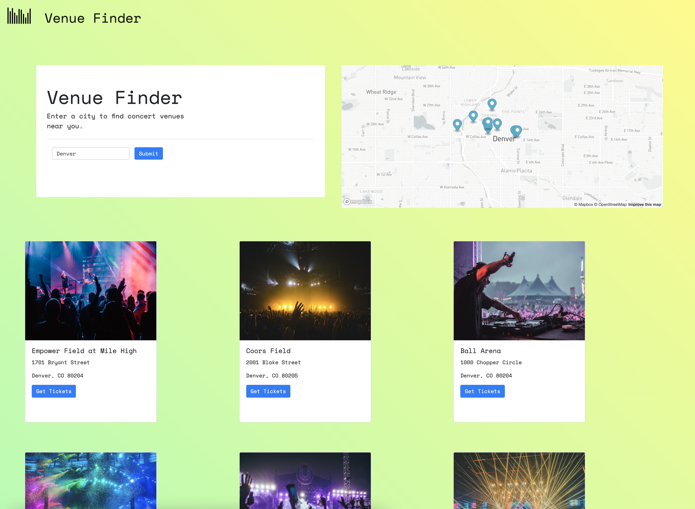

 </a>

<h1 align="center">Venue Finder</h1>

---

## 🧐 About 

- This Venue Finder allows a user to have one website they can access in order to find music venues in whatever city they would like to search. This provides the user with a list of the 9 most popular venues in the city and gives links and addresses for easy access to find tickets/events for that venue.

## 🎈 Usage 

- Uses SeatGeek API to search for venues to populate our venue cards
- Generate a list of 9 music/concert venues in the city input you typed in the search bar
- Displays individual venues on bootstrap cards
- Incorporates website links onto each of the venue cards and adds the venue address as well as a picture from our images array
- Uses SeatGeek API to search for venues to populate our venue cards
- Uses MapBox by taking lat/lon for each venue generated from SeatGeek to display where venues are located on the map and zooms in to that particular location

## ⛏️ Built Using 

- # HTML
- # CSS
- # JS
- # Bootstrap
- # MapBox API
- # SeatGeek API

## 🎉 Acknowledgements 

- 🏆 Our bootcamp instructor & TA, Ben Machock & Zac Stowell were a huge help throughout the project in pointing us in the right direction. Also thanks to MapBox and SeatGeek APIs for making their info easily accessible and free.

## 🔗 Link to deployed website

- # https://bit.ly/venuefinder

## 🖼️ Image of final website

